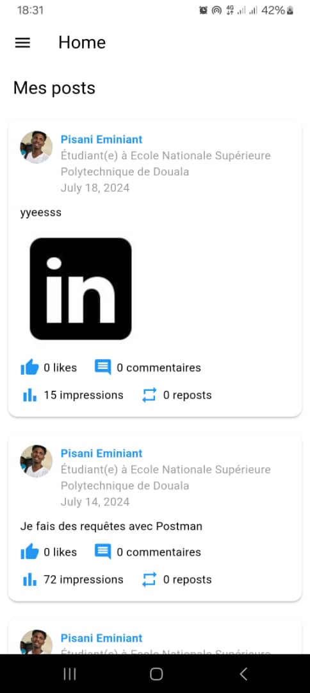

# LinkedIn API Integration - Flutter Application

## Introduction

Cette application Flutter intègre l'API LinkedIn pour permettre aux utilisateurs de publier des mises à jour, récupérer des publications, envoyer des messages et afficher les informations de profil. Ce projet a été développé dans le cadre de la compétition de développement.

## Fonctionnalités Principales

1. **Publication de Mises à Jour :** Les utilisateurs peuvent publier des mises à jour textuelles et du contenu multimédia sur leurs profils LinkedIn.
2. **Récupération de Publications :** Affiche les publications récentes d'un profil LinkedIn.
3. **Envoi de Messages :** Permet d'envoyer des messages directs aux connexions LinkedIn.
4. **Données de Profil :** Récupère et affiche les informations de base du profil de l'utilisateur authentifié.
5. **Données de Publication :** Récupère et affiche les informations de base des publications de l'utilisateur authentifié.

## Prérequis

- Flutter 2.0 ou supérieur
- Un compte LinkedIn avec une application enregistrée sur le [LinkedIn Developer Portal](https://developer.linkedin.com/)
- Client ID et Client Secret de votre application LinkedIn

## Installation

1. Clonez ce dépôt :
    ```sh
    git clone [https://github.com/darrelX/linkedin_api.git]
    cd linkedin_api
    ```

2. Installez les dépendances :
    ```sh
    flutter pub get
    ```

## Images



## Configuration de l'Authentification

1. Enregistrez votre application sur le [LinkedIn Developer Portal](https://developer.linkedin.com/).
2. Obtenez votre Client ID et Client Secret.
3. Ajoutez ces informations à votre projet Flutter :
    - Créez un fichier `.env` à la racine du projet.
    - Ajoutez les lignes suivantes :
      ```env
      CLIENT_ID=your_client_id
      CLIENT_SECRET=your_client_secret
      ```

## Utilisation de l'Application

### Authentification via OAuth 2.0

L'application utilise OAuth 2.0 pour authentifier les utilisateurs. Lors de la première utilisation, les utilisateurs seront redirigés vers la page de connexion LinkedIn pour autoriser l'application à accéder à leurs données.

### Publication de Mises à Jour

1. Naviguez vers la page de publication.
2. Entrez le texte de votre mise à jour.
3. (Optionnel) Ajoutez du contenu multimédia.
4. Appuyez sur "Publier".

### Récupération de Publications

1. Naviguez vers la page des publications.
2. Les publications récentes de votre profil LinkedIn seront affichées automatiquement.

### Envoi de Messages

1. Naviguez vers la page de messagerie.
2. Sélectionnez une connexion LinkedIn.
3. Entrez votre message.
4. Appuyez sur "Envoyer".

### Affichage des Informations de Profil

1. Naviguez vers la page de profil.
2. Les informations de base de votre profil LinkedIn seront affichées automatiquement.

Je suis impatient de présenter ce projet. Si vous avez des questions ou besoin d'assistance, n'hésitez pas à me contacter.

Merci et bonne chance à tous les participants !

Cordialement,